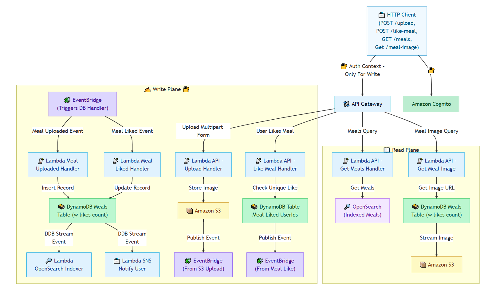

# 🍱 Smart Meals Platform

A personal project to design and prototype a full-stack meals application — built for learning, and future extensibility.

**SmartMeal** — A meal-sharing platform featuring image uploads, real-time voting, and notifications. Built with Node.js microservices on AWS using event-driven architecture (SNS, EventBridge, DynamoDB), and deployed with fully managed serverless infrastructure.

## 📑 Table of Contents

- [Architecture](#-architecture)
- [🎯 Highlights](#-highlights)
- [✅ MVP Scope](#-mvp-scope)
  - [🚧 Not Yet Implemented (Planned Work)](#-not-yet-implemented-planned-work)
- [💻 Frontend Preview](#-frontend-preview)
- [📁 Services Overview](#-services-overview)
- [🧪 Testing](#-testing)
- [📚 Motivation](#-motivation)
- [🚀 License](#-license)

## 📐 Architecture

This project follows a **CQRS architecture** and leverages:

- 🟦 Microservices (Node.js + Lambda)
- 🟩 AWS-native services: S3, DynamoDB, EventBridge, SNS, Cognito, OpenSearch, API Gateway
- 📨 Event-driven communication for **loose coupling** (pub-sub pattern)
- 🔀 Separation of write and read planes (Command-Query Responsibility Segregation)

> The full proposed design is represented in the system diagram.  
> Not everything is implemented for the MVP.

## 🎯 Highlights

- ⚙️ Node.js + AWS Lambda
- 🌐 React-based frontend (standalone, no backend wiring yet)
- 📬 API Gateway secured with **Amazon Cognito**
- 🔄 EventBridge & DynamoDB Streams used for inter-service events
- 🧠 Designed for learning and growth

## ✅ MVP Scope

The following are fully implemented and tested:

- All backend services
- End-to-end infrastructure for write and read planes
- Event-driven communication across services

### 🚧 Not Yet Implemented (Planned Work)

- **Upload & Authentication Integration** (Cognito token validation → API Gateway)
- **Like Meal Flow** (API → DynamoDB → deduplication → EventBridge)

## 💻 Frontend Preview

- **Live Preview**: [Try it!](https://smartmeal-preview.netlify.app/)
- **Source**: [`/react-client`](./react-client/)

## 📁 Services Overview

Each service is documented with its own detailed README:

- [`/auth`](./services/auth)
- [`/upload`](./services/upload-meal)
- [`/dynamodb`](./services/get-meals/events/README.md)
- [`/indexer-opensearch`](./services/get-meals/elastic-search/README.md)

## 🧪 Testing

✅ Rigorous test coverage across all services and frontend:

- **Unit Testing**: [Vitest](https://vitest.dev/) for logic
- **UI Testing**: [React Testing Library](https://testing-library.com/docs/react-testing-library/intro/)
- **Integration & Contract Tests**

## 📚 Motivation

> This project is a deep dive into:
>
> - Event-driven architecture
> - AWS serverless design patterns
> - Real-world system design for interviews

All code is open-sourced and maintained here on GitHub.

## 🚀 License

MIT License © 2025 VG — open to contributions, if you find it useful.
