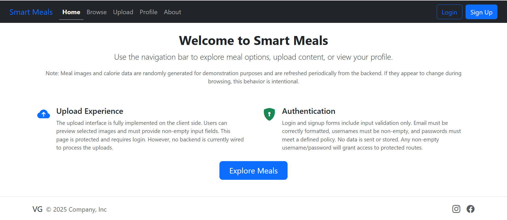

# 🍽️ Smart Meals – React Client

[Live Preview 🚀](https://smartmeal-preview.netlify.app/)

Smart Meals is a **React-powered frontend** for a full-stack meal management platform, crafted as a **portfolio project** to demonstrate modern web development practices.

> 🔌 This version runs entirely on **mock data** (no backend integration), ideal for showcasing UI/UX, architectural decisions, and front-end state management.

> 📸 Homepage view with navigation, mock upload/auth preview, and call-to-action.
> 

## 📚 Table of Contents

- [🎯 Project Vision](#-project-vision)
- [🔧 Highlights & Features](#-highlights--features)
- [✅ Ideal For](#-ideal-for)
- [📂 Backend?](#-backend)
- [📜 License](#-license)

## 🎯 Project Vision

Build a smart, modern, and responsive interface for discovering, filtering, uploading, and managing meals—scalable to production, yet perfectly suited for learning and portfolio showcasing.

## 🔧 Highlights & Features

- ⚡ **React Router v6** – Modern single-page app navigation
- 📱 **Bootstrap 5** – Fully responsive UI with adaptive Navbar
- 🔄 **Infinite scrolling** – Custom `useInfiniteMeals` hook
- 📡 **React Query** – Paginated meal fetching with `useInfiniteQuery`
- 🧾 **Auth State** – Context API for global login and route protection
- 🧰 **Custom Hooks** – e.g., `useFilteredSortedMeals`, `useSubmitHandler`
- 📝 **Form validation** – Consistent logic with reusable hooks
- 💡 **Optimized rendering** – With `React.memo` & `useMemo`
- 🔐 **Protected Routes** – Upload/Profile gated by auth
- 🧱 **Layout management** – Router `Outlet` with layout component
- 🔍 **Client-side filtering** – Scoped to available meal data
- 🎲 **Mock API** – Simulated via shuffled/randomized dummy data
- 🧩 **Separation of Concerns** – Clean views/hooks/data logic
- 🧪 **Testing** – With **Vitest** & **React Testing Library**

## ✅ Ideal For:

- Developers exploring **modern React patterns**
- Recruiters assessing **front-end architecture & practices**
- Engineers seeking **learning references** for real-world patterns

## 📂 Backend?

Each backend component is documented separately – see relevant READMEs in their respective folders.

## 📜 License

MIT – free to use, modify, and learn from.
