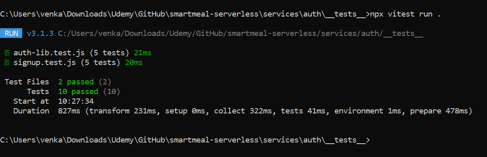

# 🔐 Auth Service - Smart Meals Platform

## 📚 Table of Contents

- [🧭 Overview](#-overview)
- [📌 Responsibilities](#-responsibilities)
- [🛠️ Key AWS Resources](#-key-aws-resources)
- [🔧 Environment Variables](#-environment-variables)
- [📡 API Endpoints](#-api-endpoints)
  - [📥 POST `/signup`](#-post-signup)
  - [🔑 POST `/login`](#-post-login)
- [🧨 Error Handling](#-error-handling)
- [🧪 Testing Strategy](#-testing-strategy)
  - [🧱 Unit Tests](#-unit-tests)
  - [🔗 Integration Tests](#-integration-tests)
  - [🧰 Tools](#-tools)
- [🔐 Security](#-security)
- [🚀 Deployment](#-deployment)
- [🔮 Future Enhancements](#-future-enhancements)

## 🧭 Overview

The Auth Service in the Smart Meals platform is a foundational microservice responsible for identity and access management. It leverages **Amazon Cognito** to securely handle user signups, confirmations, and authentication workflows.

## 📌 Responsibilities

- User registration and confirmation
- Token-based authentication

## 🛠️ Key AWS Resources

- **Amazon Cognito User Pool**: Manages user identities
- **CognitoIdentityProviderClient**: Interacts with Cognito APIs

## 🔧 Environment Variables

| Variable Name          | Description                           |
| ---------------------- | ------------------------------------- |
| `COGNITO_CLIENT_ID`    | App client ID for the user pool       |
| `COGNITO_USER_POOL_ID` | ID of the Cognito User Pool           |
| `AWS_REGION`           | AWS region where resources are hosted |

## 📡 API Endpoints

### 📥 POST `/signup`

Registers and authenticates a user in a single step.

#### Request Body

```json
{
  "username": "john_doe",
  "password": "StrongP@ssw0rd",
  "email": "john@example.com"
}
```

#### Response

```json
{
  "message": "Signup successful, confirmed, and logged in",
  "accessToken": "...",
  "idToken": "...",
  "refreshToken": "..."
}
```

### 🔑 POST `/login`

Authenticates an existing user and returns access tokens.

#### Request Body

```json
{
  "username": "john_doe",
  "password": "StrongP@ssw0rd"
}
```

#### Response

```json
{
  "accessToken": "...",
  "idToken": "...",
  "refreshToken": "..."
}
```

## 🧨 Error Handling

Common failure modes include:

- Missing or invalid request parameters
- Missing required environment variables
- Cognito service errors (e.g., UsernameExistsException, NotAuthorizedException)

All errors return a structured JSON response with HTTP 400 or 401 status.

## 🧪 Testing Strategy

### 🧱 Unit Tests

- Use `Vitest` with full mocking of AWS SDK (`CognitoIdentityProviderClient`) and auth command factory
- Validate handler behavior under various scenarios: success, input validation, missing environment variables, and Cognito failures
- Assert correct HTTP status codes and response payload structure

#### Test Output Snapshot



### 🔗 Integration Tests

- Use CLI scripts (`signup-cli.js`, `login-cli.js`) to invoke Lambda handlers with test credentials
- Validate end-to-end flows using a real Cognito test user pool
- Inspect returned `AuthenticationResult` for valid token structure

### 🧰 Tools

- **Vitest** for writing and executing unit tests
- Manual mocks of **AWS SDK v3** modules using `vi.mock` for `CognitoIdentityProviderClient` and related commands

## 🔐 Security

- Passwords never logged
- Tokens only returned after successful signup or login
- AdminConfirmSignUp used programmatically (not exposed)

## 🚀 Deployment

- Deployed as an AWS Lambda via Serverless Framework or SAM
- Requires appropriate IAM permissions for Cognito operations

## 🔮 Future Enhancements

- Multi-factor authentication (MFA) support
- Token refresh endpoint
