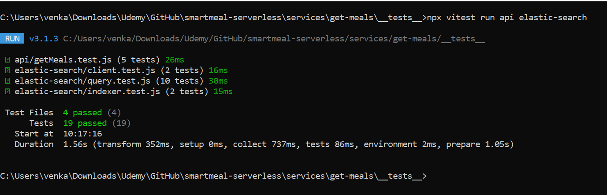

# 🔍 OpenSearch Service - Smart Meals Platform

## 📑 Table of Contents

- [Overview](#-overview)
- [Responsibilities](#-responsibilities)
- [Key AWS Resources](#key-aws-resources)
- [Environment Variables](#-environment-variables)
- [OS Library Functions](#-os-library-functions)
- [Lambda Entry Point](#-lambda-entry-point)
- [Error Handling](#-error-handling)
- [Testing Strategy](#-testing-strategy)
- [Tools](#-tools)
- [Security](#-security)
- [Deployment](#-deployment)
- [Future Enhancements](#-future-enhancements)

## 🧭 Overview

The OpenSearch (OS) Service in the Smart Meals platform powers efficient indexing and querying of meal data. It provides a typed client, indexing utilities, and search functionality, integrated as an AWS Lambda function.

## 📌 Responsibilities

- Create OpenSearch client with AWS SigV4 signing
- Index meal documents into OpenSearch
- Query meals with filters, search terms, and pagination
- Expose meals via a paginated Lambda endpoint

## Key AWS Resources

- **Amazon OpenSearch Service**: Custom OpenSearch domain created via AWS Management Console for this project
- **Lambda Function**: Handles search requests and uses the OS library
- **IAM Role**: With permissions to access OpenSearch and CloudWatch

## ⚙️ Environment Variables

| Variable Name         | Description                           |
| --------------------- | ------------------------------------- |
| `OPENSEARCH_ENDPOINT` | Endpoint of OS domain                 |
| `AWS_REGION`          | AWS region where OpenSearch is hosted |

## 📚 OS Library Functions

### 🧱 `client.js`

Creates an OpenSearch client with AWS SigV4 signing using `@opensearch-project/opensearch/aws` and default credentials.

### 🧱 `indexer.js`

Code to index a meal into the OpenSearch domain along with validation and result checks.

### 🧱 `query.js`

Function: `getMeals({ page, pageSize, userId, sortBy, sortOrder })`

- Uses OpenSearch DSL with structured filters and sorting
- Returns paginated meal data along with metadata (totalPages, hasNext, hasPrev)

## 📡 Lambda Entry Point

### 📤 GET `/meals`

Handles API Gateway requests to retrieve paginated meals data from OpenSearch.

#### Example Request

```
GET /meals?page=1&pageSize=10&sortBy=likes&sortOrder=asc&userId=user789
```

#### Example Response

```json
{
  "meals": [
    {
      "mealId": "abc123",
      "userId": "user789",
      "title": "Creamy Pasta",
      "description": "Delicious and cheesy.",
      "createdAt": "2024-04-02T15:00:00Z",
      "likes": 12
    }
  ],
  "total": 45,
  "page": 1,
  "pageSize": 10,
  "totalPages": 5,
  "hasNext": true,
  "hasPrev": false
}
```

## 🧨 Error Handling

- Missing `OPENSEARCH_ENDPOINT`
- Indexing failures
- Unexpected OpenSearch query results
- All errors are logged with context and rethrown

## 🧪 Testing Strategy

### 🧱 Unit Tests

Robust test coverage across core OpenSearch components, validating correct behavior for indexing, querying, client setup, and edge case handling.

#### 🧪 Unit Tests: `client.js`

- Ensures correct OpenSearch client construction
  - Validates signer and node config

Mocked dependencies:

- `@opensearch-project/opensearch`
- `@aws-sdk/credential-provider-node`

#### 🧪 Unit Tests: `indexer.js`

- Successfully indexes a meal
- Handles unexpected indexing result

Mocked dependencies:

- `elastic-search/client.js` with stubbed `index()` method

#### 🧪 Unit Tests: `query.js`

- Validates search, pagination, and filtering
- Covers invalid input and OpenSearch failures

Mocked dependencies:

- `elastic-search/client.js` with stubbed `search()` method

#### Test Output Snapshot



### 🔗 Integration Tests

✅ Run `node es-reset.js --query|--delete [--dry-run]`

- Ensures OpenSearch connectivity and safely verifies or deletes all index documents via dry-run or live mode.

✅ Run `node indexSampleMeals.js`

- Ensures OpenSearch index and query pagination work as expected by indexing meals, paginating results, and asserting correct timestamp sort order.

✅ Run `node meal-test-cli.js --insert <N> [--delete]`

- Simulates realistic DynamoDB records for React client integration, using a CLI powered by `commander`. Inserts sortable meal items and optionally deletes them.

### 🧰 Tools

- **Vitest** for writing and running unit tests
- **vi.mock** to isolate and mock OpenSearch-related modules
- Custom CLI scripts for local indexing, querying, and integration testing

## 🔐 Security

- Client signs requests with IAM credentials
- OpenSearch domain endpoint is public (due to MVP constraints), with strict IAM policies restricting access to specific Lambda functions and trusted clients
- Error logs do not include sensitive meal fields (e.g., image URLs)

### 🔐 Example IAM Policy

```json
{
  "Version": "2012-10-17",
  "Statement": [
    {
      "Effect": "Allow",
      "Action": [
        "es:ESHttpPost",
        "es:ESHttpPut",
        "es:ESHttpGet",
        "es:ESHttpDelete"
      ],
      "Resource": "arn:aws:es:us-east-1:<your-account-id>:domain/dev-smart-meals-es/*"
    }
  ]
}
```

- Replace `<your-account-id>` with your actual AWS account ID.

## 🚀 Deployment

- See [Key AWS Resources](#key-aws-resources) for infrastructure details
- Deployed Lambdas/scripts require IAM permissions:
  - `es:ESHttpPost`, `es:ESHttpGet`, `es:ESHttpPut` on the OpenSearch domain

## 🔮 Future Enhancements

- Add autosuggestions and support keyword search in meal titles or descriptions
- Allow filtering meals by tags or date ranges
