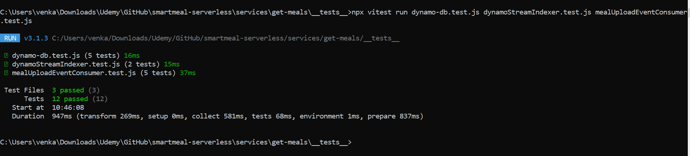

# 🗃️ DynamoDB Integration - Smart Meals Platform

## 📑 Table of Contents

- [Overview](#-overview)
- [Responsibilities](#-responsibilities)
- [Key AWS Resources](#-key-aws-resources)
- [Environment Variables](#-environment-variables)
- [Lambda Entry Points](#-lambda-entry-points)
- [Error Handling](#-error-handling)
- [Testing Strategy](#-testing-strategy)
- [Tools](#-tools)
- [Security](#-security)
- [Deployment](#-deployment)
- [Future Enhancements](#-future-enhancements)

## 🧭 Overview

This module manages the ingestion and indexing of meal data using AWS DynamoDB. It contains two key Lambda functions:

1. **S3 Upload Listener** - Responds to S3 upload notifications via EventBridge and inserts structured records into DynamoDB.
2. **DynamoDB Stream Indexer** - Processes DynamoDB stream events and forwards meals to the OpenSearch indexer for search capabilities.

## 📌 Responsibilities

- Listen for `MealUploaded` events via EventBridge (triggered by upstream S3 uploads).
- Validate and transform meal metadata into structured DynamoDB records.
- Insert meal records into the `MealsRead` DynamoDB table.
- React to DynamoDB stream events on `INSERT` and `MODIFY`.
- Index new/updated meal records into OpenSearch.

## 🔑 Key AWS Resources

- **DynamoDB Table**: Stores structured meal records.
- **EventBridge Rule**: Triggers meal ingestion from S3 upload events.
- **DynamoDB Stream**: Triggers OpenSearch indexing on record change.
- **Lambda Functions**:
  - `mealUploadEventConsumer.js`
  - `dynamoStreamIndexer.js`

## 🧪 Environment Variables

| Variable Name         | Description                |
| --------------------- | -------------------------- |
| `MEALS_TABLE`         | Name of the DynamoDB table |
| `OPENSEARCH_ENDPOINT` | Endpoint of OS domain      |
| `AWS_REGION`          | AWS region                 |

// vegorla: sample events or block diagram?

## 🔁 Lambda Entry Points

- **mealUploadEventConsumer.js**

  - **Trigger**: EventBridge (`MealUploaded` events)
  - **Action**: Validate and transform event payload → insert into `MealsRead` DynamoDB table

- **dynamoStreamIndexer.js**
  - **Trigger**: DynamoDB Stream (on `INSERT` or `MODIFY`)
  - **Action**: Unmarshall new record → index meal into OpenSearch via a library function

## 🧯 Error Handling

- Each Lambda is wrapped with try/catch blocks and logs detailed error messages.
- Invalid records are logged and skipped (no retries currently).
- Future improvements may include DLQ (Dead Letter Queue) support.

## 🧪 Testing Strategy

### 🧱 Unit Tests

All critical paths (success and failure) are covered using mocked dependencies.

- **mealUploadEventConsumer.test.js**

  - Tests both the Lambda `handler` and its internal logic
  - Reuses fixture from `upload-meal` for consistent test data

- **dynamoStreamIndexer.test.js**

  - Mocks `unmarshall` and `indexMeal` to simulate stream processing and indexing

- **dynamo-db.test.js**
  - Validates structure, defaults, and error handling in the `buildMealReadModelItem` transformer

#### Test Output Snapshot

### 🔗 Integration Tests

✅ Run `node dynamo-sample-stream.js`

- Triggers a create + update sequence on a fixed meal record to verify DynamoDB stream → Lambda integration.

## 🧰 Tools

- **Vitest** for writing and running unit tests
- **`vi.mock`** for isolating and mocking DynamoDB modules
- Custom CLI script for **DynamoDB → OpenSearch** integration testing

## 🔐 Security

- Principle of least privilege in IAM roles
- Encrypted data at rest and in transit
- No sensitive data stored in logs

## 🚀 Deployment

- Managed using the Serverless Framework
- Deploys DynamoDB tables and Lambda functions together
- Requires appropriate IAM permissions for DynamoDB operations

## 🌱 Future Enhancements

- Add Dead Letter Queues (DLQ) for failed events
- Add tracing with AWS X-Ray
- Use schema validation (e.g., with Joi)
- Integrate Lambda Powertools for JS to standardize logging, tracing, and metrics across all Lambdas.
