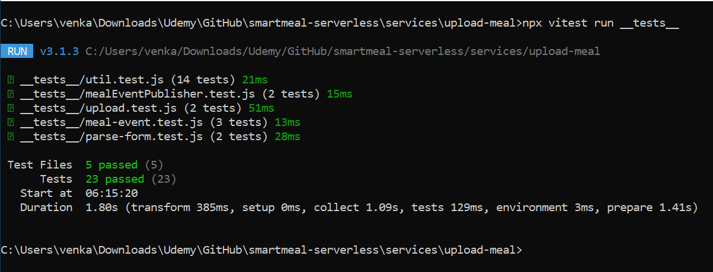

# 📦 Upload Service - Smart Meals Platform

## 📚 Table of Contents

- [🧭 Overview](#-overview)
- [🧬 Upload Pipeline](#-upload-pipeline)
- [📌 Responsibilities](#-responsibilities)
- [🔑 Key AWS Resources](#-key-aws-resources)
- [🔧 Environment Variables](#-environment-variables)
- [📡 API Endpoints](#-api-endpoints)
  - [📤 POST `/upload`](#-post-upload)
- [🧨 Error Handling](#-error-handling)
- [🧪 Testing Strategy](#-testing-strategy)
  - [🧱 Unit Tests](#-unit-tests)
  - [🔗 Integration Tests](#-integration-tests)
  - [🧰 Tools](#-tools)
- [🔐 Security](#-security)
- [🚀 Deployment](#-deployment)
- [🔮 Future Enhancements](#-future-enhancements)

## 🧭 Overview

The Upload Service handles multipart meal media uploads. It stores files in S3 and publishes a meal event for downstream consumers.

## 🧬 Upload Pipeline


## 📌 Responsibilities

- Handle multipart form data via custom `Busboy` parser (`parse-form.js`).
- Validate and upload files to S3 with structured metadata.
- Generate and publish `MealUploaded` events to EventBridge (`buildMealUploadedEvent`, `publishMealUploadedEvent`).

## 🔑 Key AWS Resources

- **S3 Bucket**: Stores uploaded meal media.
- **Lambda Function**: Core logic for file validation, S3 upload, and event publication.
- **EventBridge**: Publishes `meal.uploaded` events.

## 🔧 Environment Variables

| Variable      | Description                      |
| ------------- | -------------------------------- |
| `BUCKET_NAME` | Target S3 bucket for file upload |

## 📡 API Endpoints

### 📤 POST `/upload`

**Description:** Uploads a meal image along with title and description.

- **Content-Type**: `multipart/form-data`
- **Body Fields**:
  - `file`: image file (`.jpg`, `.png`, max 300KB)
  - `title`: string (required)
  - `description`: string (required)

**Response:**

```json
{
  "message": "Meal uploaded to S3 and event published."
}
```

**Error Response:**

```json
{
  "error": "title and description required"
}
```

## 🧨 Error Handling

- 400: Missing or invalid fields.
- 415: Invalid file type.
- 500: Unexpected server or AWS error.
- File uploads are validated via `validateFile()` in `util.js` (type, size, structure).
- Invalid MIME types or large files trigger structured error responses.

## 🧪 Testing Strategy

### 🧱 Unit Tests

Located in `services\upload-meal\__tests__`, this service includes comprehensive unit tests using `vitest` with full mocking of AWS SDK v3 modules.

The test suite covers:

✅ **Multipart parsing** (`parse-form.test.js`)  
✅ **File validation, S3 metadata, and key generation** (`util.test.js`)  
✅ **Lambda entry point behavior including full success/failure paths** (`upload.test.js`)  
✅ **Meal event construction and formatting** (`meal-event.test.js`)  
✅ **EventBridge publishing logic** (`mealEventPublisher.test.js`)

> Tests assert correctness, error handling, and edge cases. Readers are encouraged to explore the test code directly.



### 🔗 Integration Tests

- End-to-end test for upload to S3 and event emission (`integration-test\s3-upload.js`)

### 🧰 Tools

- Vitest, AWS SDK v3 mocks, Multipart parser mocks

## 🔐 Security

- File types and sizes are validated.
- S3 objects include sanitized metadata.
- TODO: Enforce authenticated user context.

## 🚀 Deployment

- Packaged as a Lambda function
- Triggered by HTTP API Gateway proxy

## 🔮 Future Enhancements

- Enforce IAM identity via Cognito or JWT
- Virus scanning on upload
- Image optimization pipeline
